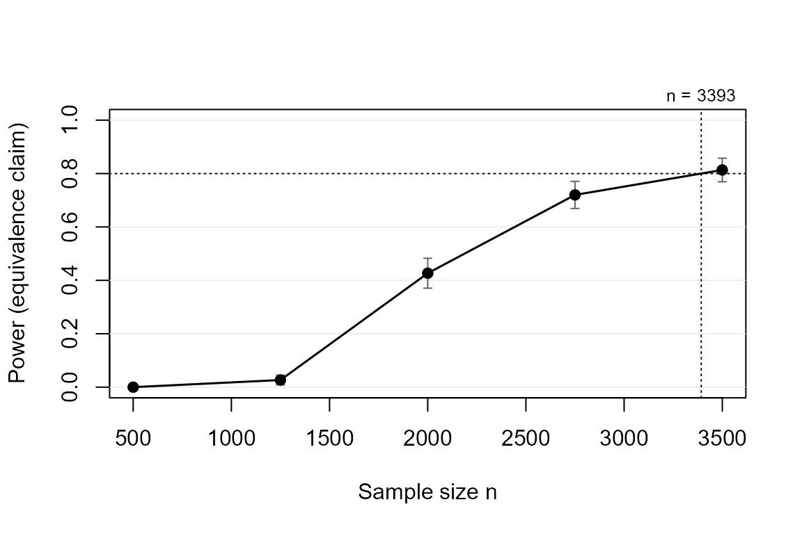

# Powering for equivalence: showing an effect is too small to matter

## The claim

Sometimes the research goal is to show an effect is *negligible*: a
cheaper treatment is not meaningfully worse, a feared side effect is not
meaningfully present. The equivalence claim succeeds when the whole
confidence interval lies inside (-SESOI, +SESOI). A non-significant test
is **not** evidence of absence; a CI inside the equivalence bounds is.

``` r

library(powerape)

d <- ape_dgp(model = "probit",
             focal = pa_var("treat", "binary", p = 0.5),
             covariates = list(pa_var("age", "normal", mean = 45, sd = 12)),
             baseline = 0.30, signal = 0.10)
d <- set_ape(d, target = 0)    # planning value: no effect at all
```

The coherence guard requires \|target\| \< SESOI: you cannot power for
equivalence while assuming a true effect on or beyond the bounds.

## Power and required n

``` r

ape_power(d, n = 2000, claim = "equivalence", sesoi = 0.05,
          nsim = 600, seed = 1)
#> powerape -- equivalence claim (CI within +/-0.050)
#>   probit, n = 2000, assumed true APE +0.0000, 95% CI, nsim = 600
#>   power = 0.417 (MCSE 0.020)
#>   outcomes: minimum 0.000 | detect-only 0.018 | inconclusive 0.565 | equivalence 0.417 | failed 0.000
```

``` r

ape_n(d, power = 0.80, claim = "equivalence", sesoi = 0.05,
      nsim = 500, seed = 2)
#> powerape required sample size -- equivalence claim
#>   n = 3584 for 80% target power (confirmed 0.855, MCSE 0.008)
#>   assumed true APE +0.0000, sesoi 0.050, 95% CI, probit
#>   search: 4 step(s); confirmed in 1 round(s) at nsim = 2000.
```

Equivalence needs the CI to be *narrow*, not just centered near zero, so
sample sizes are driven entirely by the SESOI: halving the SESOI roughly
quadruples the required n.

``` r

cv <- ape_curve(d, n = seq(500, 3500, by = 750), claim = "equivalence",
                sesoi = 0.05, nsim = 300, seed = 3)
plot(cv, target_power = 0.80)
```



## A robustness note

The width of the CI for an APE depends on the baseline rate (binomial
variance peaks at 0.5), so equivalence power inherits that dependence.
[`ape_robust()`](https://jespernwulff.github.io/powerape/reference/ape_robust.md)
makes it visible:

``` r

ape_robust(d, n = 2600, claim = "equivalence", sesoi = 0.05,
           vary = list(baseline = c(0.20, 0.50)), grid_points = 3,
           nsim = 300, seed = 4, nmax = FALSE)
#> powerape robustness sweep -- equivalence claim, APE, pin = ape
#>   n = 2600, nsim = 300 per scenario, 3 scenario(s) over: baseline
#>   power range [0.513, 0.807]; worst scenario:
#>  baseline implied_effect     power       mcse
#>       0.5              0 0.5133333 0.02885725
#>   scenarios:
#>  baseline implied_effect     power       mcse
#>      0.20              0 0.8066667 0.02280026
#>      0.35              0 0.5700000 0.02858321
#>      0.50              0 0.5133333 0.02885725
```

## Reporting

[`power_statement()`](https://jespernwulff.github.io/powerape/reference/power_statement.md)
works for equivalence designs too, and states the CI convention
explicitly – with a 95% interval the implied two one-sided tests run at
the conservative 2.5% level (Riesthuis, 2024).

``` r

pw <- ape_power(d, n = 2600, claim = "equivalence", sesoi = 0.05,
                nsim = 500, seed = 5)
power_statement(pw)
#> We conducted a simulation-based power analysis for the average partial effect
#> (APE) of treat using the powerape package (version 1.3.0), following the
#> confidence-interval approach of Riesthuis (2024). The assumed data-generating
#> process was a probit model with focal variable treat (binary, prevalence
#> 0.50); parametric covariates (age; Gaussian-copula dependence); baseline
#> outcome rate 0.300 with the focal at reference; nuisance covariates
#> contribute a latent pseudo-R-squared of 0.10. The assumed true APE was 0.000
#> (0.0 percentage points). At a sample size of n = 2600, simulated power for
#> the equivalence claim (the 95% confidence interval lying within +/-0.050) was
#> 0.632 (Monte Carlo SE 0.022; 500 replications). Across replications, the
#> probability of concluding a meaningful effect was 0.000, of detection without
#> meaningfulness 0.018, of an inconclusive result 0.350, and of equivalence
#> 0.632. Estimation used maximum likelihood with delta-method Wald confidence
#> intervals; replications that failed to converge (0.0%) counted against the
#> claim.
```
