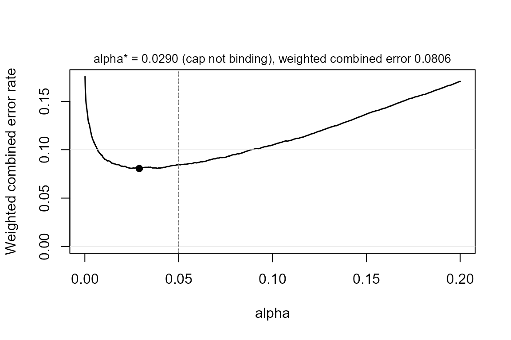

# Justifying the error rate: alpha by sample size, or by error costs

## The default, and the argument

Every claim in powerape is tested at `alpha = 0.05` in the form its
literature uses: detection is the two-sided test read off the 95%
interval, the minimum-effect claim a one-sided test and equivalence a
TOST, both read off the 90% interval. The level is an argument of every
power function, so a stricter convention is one keyword away:

``` r

library(powerape)

d <- ape_dgp(model = "probit",
             focal = pa_var("program", "binary", p = 0.5),
             covariates = list(pa_var("z", "normal")),
             baseline = 0.30, signal = 0.10)
d <- set_ape(d, target = 0.10)

ape_power(d, n = 2000, claim = "minimum", sesoi = 0.05, nsim = 400, seed = 1)
#> powerape -- minimum-effect claim (CI lower bound > 0.050)
#>   probit, n = 2000, assumed true APE +0.1000, 90% CI (alpha = 0.05), nsim = 400
#>   power = 0.787 (MCSE 0.020)
#>   outcomes: minimum 0.787 | detect-only 0.212 | inconclusive 0.000 | equivalence 0.000 | failed 0.000
ape_power(d, n = 2000, claim = "minimum", sesoi = 0.05, alpha = 0.01,
          nsim = 400, seed = 1)
#> powerape -- minimum-effect claim (CI lower bound > 0.050)
#>   probit, n = 2000, assumed true APE +0.1000, 98% CI (alpha = 0.01), nsim = 400
#>   power = 0.542 (MCSE 0.025)
#>   outcomes: minimum 0.542 | detect-only 0.445 | inconclusive 0.012 | equivalence 0.000 | failed 0.000
```

Maier and Lakens (2022) give two reasons not to stop at the default.
First, with a fixed budget of observations the error rate that minimizes
the combined cost of Type I and Type II errors is rarely exactly .05.
Second, in large samples a *p* value just below .05 can be more likely
under the null than under the alternative (Lindley’s paradox), so the
level should fall as *n* grows. powerape supports both justifications.

## Alpha as a function of the sample size

`alpha` may be a function of *n*. It is evaluated at every candidate
sample size, so
[`ape_n()`](https://jespernwulff.github.io/powerape/reference/ape_n.md)
designs jointly over the pair (alpha(*n*), *n*), and
[`ape_curve()`](https://jespernwulff.github.io/powerape/reference/ape_curve.md),
[`ape_mde()`](https://jespernwulff.github.io/powerape/reference/ape_mde.md),
and
[`ape_robust()`](https://jespernwulff.github.io/powerape/reference/ape_robust.md)
use the level that belongs to their *n*. Any rule works; the natural one
for regression coefficients is the Bayes-factor calibration of Wulff and
Taylor (2024) in the alphaN package, where `BF = 1` is the largest level
that avoids Lindley’s paradox and `BF = 3` asks a significant result to
carry moderate evidence.

``` r

rule <- function(n) alphaN::alphaN(n, BF = 3)
rule(c(500, 2000, 8000))
#> [1] 0.0037278668 0.0017468970 0.0008248697

ape_n(d, power = 0.80, claim = "minimum", sesoi = 0.05, alpha = rule,
      nsim = 300, seed = 2, confirm = FALSE)
#> powerape required sample size -- minimum claim
#>   n = 5191 for 80% target power (achieved 0.823, MCSE 0.022)
#>   assumed true APE +0.1000, sesoi 0.050, 99.79% CI (alpha = 0.001042 by sample-size rule), probit
#>   search: 1 step(s); confirm with ape_power() at a larger nsim.
```

The requirement rises well above the fixed-.05 answer (about 2,100 for
this design), because the level keeps tightening as the search moves to
larger *n*. The returned object stores the rule and the level it
produced at the chosen *n*, and
[`power_statement()`](https://jespernwulff.github.io/powerape/reference/power_statement.md)
says so.

``` r

pw_rule <- ape_power(d, n = 5000, claim = "minimum", sesoi = 0.05,
                     alpha = rule, nsim = 400, seed = 3)
pw_rule
#> powerape -- minimum-effect claim (CI lower bound > 0.050)
#>   probit, n = 5000, assumed true APE +0.1000, 99.79% CI (alpha = 0.001063 by sample-size rule), nsim = 400
#>   power = 0.790 (MCSE 0.020)
#>   outcomes: minimum 0.790 | detect-only 0.210 | inconclusive 0.000 | equivalence 0.000 | failed 0.000
power_statement(pw_rule)
#> We conducted a simulation-based power analysis for the average partial effect
#> (APE) of program using the powerape package (version 1.10.0), following the
#> confidence-interval approach of Riesthuis (2024). The assumed data-generating
#> process was a probit model with focal variable program (binary, prevalence
#> 0.50); parametric covariates (z; Gaussian-copula dependence); baseline
#> outcome rate 0.300 with the focal at reference; nuisance covariates
#> contribute a latent pseudo-R-squared of 0.10. The assumed true APE was 0.100
#> (10.0 percentage points). At a sample size of n = 5000, simulated power for
#> the minimum-effect claim (the 99.79% confidence interval's lower bound
#> exceeding the smallest effect size of interest, 0.050; a one-sided test at
#> alpha = 0.106%, set as a function of the sample size) was 0.790 (Monte Carlo
#> SE 0.020; 400 replications). Across replications, the probability of
#> concluding a meaningful effect was 0.790, of detection without meaningfulness
#> 0.210, of an inconclusive result 0.000, and of equivalence 0.000. Estimation
#> used maximum likelihood with delta-method Wald confidence intervals;
#> replications that failed to converge (0.0%) counted against the claim.
```

## Alpha from error costs

The second route is decision-theoretic. For a design with a fixed *n*,
the weighted combined error rate

``` math
 w(\alpha) = \frac{cost \cdot \alpha + prior \cdot \beta(\alpha)}{cost + prior} 
```

weighs a Type I error `cost` times as heavily as a Type II error and the
two hypotheses by their prior odds (Mudge et al., 2012). powerape
evaluates the whole curve from **one** simulation:
[`ape_power()`](https://jespernwulff.github.io/powerape/reference/ape_power.md)
keeps the estimate and standard error of every replication, and power at
any level is a re-threshold of those draws.
[`power_at()`](https://jespernwulff.github.io/powerape/reference/power_at.md)
exposes the curve;
[`ape_alpha()`](https://jespernwulff.github.io/powerape/reference/ape_alpha.md)
minimizes or balances it.

``` r

pw <- ape_power(d, n = 2000, claim = "minimum", sesoi = 0.05,
                nsim = 1000, seed = 4)
power_at(pw, alpha = c(0.005, 0.01, 0.025, 0.05, 0.10))
#>   alpha conf power       mcse minimum detect_only inconclusive equivalence
#> 1 0.005 0.99 0.485 0.01580427   0.485       0.498        0.017           0
#> 2 0.010 0.98 0.581 0.01560253   0.581       0.413        0.006           0
#> 3 0.025 0.95 0.696 0.01454593   0.696       0.301        0.003           0
#> 4 0.050 0.90 0.778 0.01314215   0.778       0.222        0.000           0
#> 5 0.100 0.80 0.876 0.01042228   0.876       0.124        0.000           0
#>   failed
#> 1      0
#> 2      0
#> 3      0
#> 4      0
#> 5      0

ja <- ape_alpha(pw, cost = 4, prior = 1)      # Cohen's 4:1 weighting
ja
#> powerape justified alpha -- minimum-effect claim (CI lower bound > 0.050), n = 2000, nsim = 1000
#>   objective: minimize the weighted combined error rate (Type I cost x4, prior odds H1:H0 = 1)
#>   alpha* = 0.0290 -> power 0.713 (MCSE 0.014), beta 0.287, weighted combined error 0.0806
#>   at alpha = 0.05: power 0.778, weighted combined error 0.0844
#>   flat range: alpha in [0.0190, 0.0460] is indistinguishable from the optimum at this nsim
#>   cap 0.050 not binding (unconstrained optimum 0.0290)
plot(ja)
```



Two things to notice. The objective is flat around its optimum, so the
result reports the range of levels that cannot be told apart from the
optimum at this number of replications; that range, not the point, is
what to preregister unless `nsim` is large. And the search is capped at
.05: when the unconstrained optimum lies above the conventional level,
as it does for designs below their required *n* with equal error costs,
the function says so rather than returning it, following Maier and
Lakens’s advice that raising alpha needs a justification of its own and
that journals may accept only lowering.

``` r

ape_alpha(pw, cost = 1, prior = 1)
#> powerape justified alpha -- minimum-effect claim (CI lower bound > 0.050), n = 2000, nsim = 1000
#>   objective: minimize the weighted combined error rate (Type I cost x1, prior odds H1:H0 = 1)
#>   alpha* = 0.0500 -> power 0.778 (MCSE 0.013), beta 0.222, weighted combined error 0.1360
#>   at alpha = 0.05: power 0.778, weighted combined error 0.1360
#>   flat range: alpha in [0.0400, 0.0500] is indistinguishable from the optimum at this nsim
#>   cap 0.050 BINDS: unconstrained optimum alpha = 0.1165 (weighted combined error 0.1082);
#>     raising alpha above the conventional level needs its own justification (Maier & Lakens, 2022).
```

Balancing instead of minimizing asks for `cost * alpha = prior * beta`;
at a design’s required *n* for 80% power, Cohen’s 4:1 weighting returns
the familiar .05/.20 pair by construction.

## The frontier level: one alpha for a whole MDE grid

[`ape_alpha()`](https://jespernwulff.github.io/powerape/reference/ape_alpha.md)
needs a pinned effect, because its Type II error is one minus power *at
the planning value*. In a minimum-detectable-effect analysis the effect
is the answer, not an input, and re-optimizing the level at every
candidate effect chases a moving target. The way out is a fixed point:
the level that is optimal *for the effect that is just detectable at the
target power*. Under the normal approximation that first-order condition
loses both *n* and the standard error, so one level prices every sample
size, and
[`alpha_frontier()`](https://jespernwulff.github.io/powerape/reference/alpha_frontier.md)
returns it in closed form.

``` r

alpha_frontier(cost = 4, power = 0.80)                    # two-sided, 0.0274
#> [1] 0.02737173
alpha_frontier(cost = 1, power = 0.80, claim = "minimum") # exactly 1 - power
#> [1] 0.2
```

Passing it as `alpha` re-prices an MDE analysis (or a grid of them)
under the justified level:

``` r

ape_mde(d, n = 3000, claim = "detect",
        alpha = alpha_frontier(cost = 4, power = 0.80), seed = 6)
```

At equal costs the one-sided frontier level is exactly `1 - power` – the
frontier is where alpha and beta balance. Unlike
[`ape_alpha()`](https://jespernwulff.github.io/powerape/reference/ape_alpha.md),
the frontier level is an approximation (normal, and pinned to the
just-detectable effect) and carries no .05 cap, so treat levels above
the convention with the same caution as an uncapped
[`ape_alpha()`](https://jespernwulff.github.io/powerape/reference/ape_alpha.md)
optimum.

## Checking the size, and reporting

Because the Type I error of a SESOI claim is its size at the claim
boundary, `size = TRUE` simulates the world in which the true effect
equals the SESOI and reports the realized error rate at the chosen
level, something analytic compromise-power tools cannot do. On the
standard routes it matches the nominal level within Monte Carlo error;
on clustered panels with few units it may not, and then the realized
number is the one to report.

``` r

ja4 <- ape_alpha(pw, cost = 4, prior = 1, size = TRUE, nsim_size = 500,
                 seed = 5)
ja4
#> powerape justified alpha -- minimum-effect claim (CI lower bound > 0.050), n = 2000, nsim = 1000
#>   objective: minimize the weighted combined error rate (Type I cost x4, prior odds H1:H0 = 1)
#>   alpha* = 0.0290 -> power 0.713 (MCSE 0.014), beta 0.287, weighted combined error 0.0806
#>   at alpha = 0.05: power 0.778, weighted combined error 0.0844
#>   flat range: alpha in [0.0190, 0.0460] is indistinguishable from the optimum at this nsim
#>   cap 0.050 not binding (unconstrained optimum 0.0290)
#>   realized size at the claim boundary (true APE = 0.050): 0.0240 (MCSE 0.0068, nsim 500)
power_statement(ja4)
#> We chose the error rate for the minimum-effect claim (the 94.2% confidence
#> interval's lower bound exceeding the smallest effect size of interest, 0.050;
#> a one-sided test at alpha = 2.9%) by minimizing the weighted combined Type I
#> and Type II error rate (Maier & Lakens, 2022; Mudge et al., 2012), weighting
#> a Type I error 4 times a Type II error and taking prior odds of 1 for the
#> planning value (APE = 0.100) against the claim boundary, using the powerape
#> package (version 1.10.0). The assumed data-generating process was a probit
#> model with focal variable program (binary, prevalence 0.50); parametric
#> covariates (z; Gaussian-copula dependence); baseline outcome rate 0.300 with
#> the focal at reference; nuisance covariates contribute a latent
#> pseudo-R-squared of 0.10. At n = 2000 the optimum within the conventional cap
#> of alpha = 0.05 was alpha = 0.0290: simulated power 0.713 (Monte Carlo SE
#> 0.014; 1000 replications), a Type II error rate of 0.287, and a weighted
#> combined error rate of 0.0806 versus 0.0844 at alpha = 0.05; error rates
#> between 0.0190 and 0.0460 are indistinguishable from the optimum at this
#> precision. A verification simulation at the claim boundary (true APE = 0.050;
#> 500 replications) gave a realized error rate of 0.0240 (Monte Carlo SE
#> 0.0068) at the chosen alpha.
```

The statement names the objective, the weights, the level, the flat
range, the cap, and the verification, ready for a preregistration.

## References

Maier, M., & Lakens, D. (2022). Justify your alpha: A primer on two
practical approaches. *Advances in Methods and Practices in
Psychological Science, 5*(2).

Mudge, J. F., Baker, L. F., Edge, C. B., & Houlahan, J. E. (2012).
Setting an optimal alpha that minimizes errors in null hypothesis
significance tests. *PLOS ONE, 7*(2), e32734.

Wulff, J. N., & Taylor, L. (2024). How and why alpha should depend on
sample size: A Bayesian-frequentist compromise for significance testing.
*Strategic Organization, 22*(3), 550–581.
