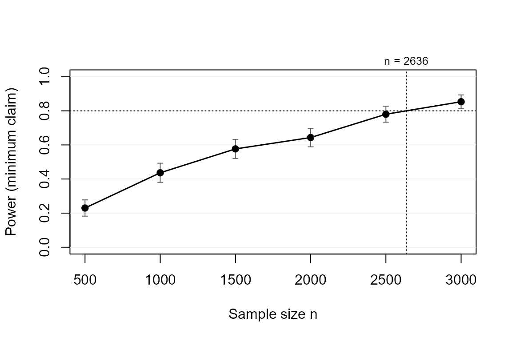

# Powering the minimum-effect claim

## Why power for an APE at all?

In a probit or logit model, the coefficient is not the quantity anyone
interprets. Applied conclusions are stated in probability points – “the
treatment raises take-up by 10 percentage points” – which is the
**average partial effect (APE)**. The APE depends on *all* coefficients
and on the covariate distribution, so power tools that work in
coefficient or Cohen’s-d units cannot answer the question practitioners
actually have.

`powerape` lets you specify the target in APE units and simulates the
whole pipeline: draw covariates, draw outcomes, fit the model by maximum
likelihood, compute the APE with a delta-method Wald confidence
interval, and evaluate a **claim** on that interval (Riesthuis, 2024):

- `"minimum"` – the CI lower bound exceeds the smallest effect size of
  interest (SESOI): the effect is *meaningfully* large. This is the
  default claim and the package’s reason to exist.
- `"detect"` – the CI excludes zero (directional).
- `"equivalence"` – the CI lies inside (-SESOI, +SESOI): the effect is
  too small to matter.

## Step 1: describe the world

``` r

library(powerape)

d <- ape_dgp(
  model       = "probit",
  focal       = pa_var("treat", "binary", p = 0.5),
  covariates  = list(pa_var("age", "normal", mean = 45, sd = 12),
                     pa_var("female", "binary", p = 0.55)),
  correlation = 0.2,
  baseline    = 0.30,   # P(Y = 1) with treat = 0
  signal      = 0.15    # latent pseudo-R2 of the covariates
)
```

The nuisance side is anchored on a friendly scale: the **baseline
outcome rate** and the covariates’ **latent pseudo-R-squared**. Explicit
coefficients (`gamma`), pilot data
([`ape_dgp_empirical()`](https://jespernwulff.github.io/powerape/reference/ape_dgp_empirical.md)),
or a fitted pilot model
([`ape_dgp_from_fit()`](https://jespernwulff.github.io/powerape/reference/ape_dgp_from_fit.md))
are the expert routes.

## Step 2: pin the true APE (the inversion step)

Suppose theory or prior evidence suggests a true effect of 10 percentage
points, and effects below 5 points would not justify the intervention:
the planning value is 0.10 and the SESOI is 0.05.

``` r

d <- set_ape(d, target = 0.10)
d
#> powerape DGP -- probit
#>   focal: treat (binary, p = 0.50)
#>   covariates: age (normal, mean 45.00, sd 12.00), female (binary, p = 0.55) 
#>   baseline P(Y=1 | reference) = 0.300, nuisance signal (latent pseudo-R2) = 0.150
#>   true APE pinned at +0.1000 (beta_focal = 0.2943, implied P(Y=1 | focal=1) = 0.400)
```

[`set_ape()`](https://jespernwulff.github.io/powerape/reference/set_ape.md)
solves for the focal coefficient that makes the true APE exactly 0.10
given everything else, and errors informatively if the target is
infeasible (an APE of +0.40 cannot exist at a baseline rate of 0.85).

## Step 3: power for the claim

``` r

ape_power(d, n = 1500, claim = "minimum", sesoi = 0.05,
          nsim = 500, seed = 1)
#> powerape -- minimum-effect claim (CI lower bound > 0.050)
#>   probit, n = 1500, assumed true APE +0.1000, 95% CI, nsim = 500
#>   power = 0.562 (MCSE 0.022)
#>   outcomes: minimum 0.562 | detect-only 0.430 | inconclusive 0.008 | equivalence 0.000 | failed 0.000
```

Read the **outcome distribution**, not just the power number: some
studies would reject zero yet remain unable to claim the effect clears
the SESOI (“detect-only”) – exactly the inconclusiveness Riesthuis
(2024) warns about.

## Step 4: required sample size and the power curve

``` r

ape_n(d, power = 0.80, claim = "minimum", sesoi = 0.05,
      nsim = 500, seed = 2)
#> powerape required sample size -- minimum claim
#>   n = 2673 for 80% target power (confirmed 0.799, MCSE 0.009)
#>   assumed true APE +0.1000, sesoi 0.050, 95% CI, probit
#>   search: 1 step(s); confirmed in 1 round(s) at nsim = 2000.
```

``` r

cv <- ape_curve(d, n = seq(500, 3000, by = 500), claim = "minimum",
                sesoi = 0.05, nsim = 300, seed = 3)
plot(cv, target_power = 0.80)
```



## Step 5: how fragile is this to the contextual guesses?

The baseline rate and the covariate signal are guesses, and power
computed from a single guess is fragile (Hancock & Feng, 2025).
[`ape_robust()`](https://jespernwulff.github.io/powerape/reference/ape_robust.md)
re-runs the analysis over a scenario grid and reports the worst case;
with `nmax = TRUE` it also finds **n_max**, the insurance-premium sample
size that holds the target power in the worst scenario.

``` r

ape_robust(d, n = 2200, claim = "minimum", sesoi = 0.05,
           vary = list(baseline = c(0.20, 0.40)), grid_points = 3,
           nsim = 300, seed = 4, nmax = FALSE)
#> powerape robustness sweep -- minimum claim, APE, pin = ape
#>   n = 2200, nsim = 300 per scenario, 3 scenario(s) over: baseline
#>   power range [0.687, 0.773]; worst scenario:
#>  baseline implied_effect     power       mcse
#>       0.4            0.1 0.6866667 0.02678031
#>   scenarios:
#>  baseline implied_effect     power       mcse
#>       0.2            0.1 0.7733333 0.02417222
#>       0.3            0.1 0.7333333 0.02553139
#>       0.4            0.1 0.6866667 0.02678031
```

By default the APE is **re-pinned in every scenario** (`pin = "ape"`),
so only the precision channel varies; `pin = "coefficients"` instead
holds the coefficients and lets the implied effect drift.

## Step 6: the citable paragraph

``` r

pw <- ape_power(d, n = 2200, claim = "minimum", sesoi = 0.05,
                nsim = 500, seed = 5)
power_statement(pw)
#> We conducted a simulation-based power analysis for the average partial effect
#> (APE) of treat using the powerape package (version 1.5.0), following the
#> confidence-interval approach of Riesthuis (2024). The assumed data-generating
#> process was a probit model with focal variable treat (binary, prevalence
#> 0.50); parametric covariates (age, female; Gaussian-copula dependence);
#> baseline outcome rate 0.300 with the focal at reference; nuisance covariates
#> contribute a latent pseudo-R-squared of 0.15. The assumed true APE was 0.100
#> (10.0 percentage points). At a sample size of n = 2200, simulated power for
#> the minimum-effect claim (the 95% confidence interval's lower bound exceeding
#> the smallest effect size of interest, 0.050) was 0.710 (Monte Carlo SE 0.020;
#> 500 replications). Across replications, the probability of concluding a
#> meaningful effect was 0.710, of detection without meaningfulness 0.290, of an
#> inconclusive result 0.000, and of equivalence 0.000. Estimation used maximum
#> likelihood with delta-method Wald confidence intervals; replications that
#> failed to converge (0.0%) counted against the claim.
```

## References

- Hancock, G. R., & Feng, Y. (2025). nmax and the quest to restore
  caution, integrity, and practicality to the sample size planning
  process. *Psychological Methods*.
- Riesthuis, P. (2024). Simulation-based power analyses for the smallest
  effect size of interest: A confidence-interval approach for
  minimum-effect and equivalence testing. *AMPPS*, 7(2).
